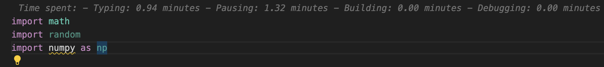

# **Time Tracker Extension for VS Code**

This is the README for the extension "timetracker". 

## 📌 **Overview**

The **Time Tracker Extension** helps me see how I spend my time in Visual Studio Code. It tracks and displays the time I spend on the following activities:

- **Typing:** Active coding time when I'm writing or editing code.
- **Idle:** Staying idle in the editor.
- **Building:** Time spent running build tasks.
- **Debugging:** Time spent debugging.

This extension keeps the information visible at all times, helping me stay mindful and demure.

---

## 🚀 **Features**
- 🕒 **Real-time tracking** of typing, idle, build, and debugging durations.
- 📊 **Live display** in the status bar for quick reference.
- 🔄 **Automatic tracking** with no manual intervention required.

## 💡 **How to Use**

1. **Start VS Code**: Import the extension in VS Code.
2. **View Time**: Check the status bar to see the real-time stats:
   - Typing: `⏳ Typing: 45 min`
   - Idle: `💤 Idle: 10 min`
   - Building: `🔨 Build: 5 min`
   - Debugging: `🐞 Debug: 15 min`

---

## 💬 **Contributing**
Contributions are welcome! Please feel free to submit them here [GitHub repository](https://github.com/ErikaMolnar).

---

## 📜 **License**
This extension is licensed under the [MIT License](https://opensource.org/licenses/MIT). See the `LICENSE` file for more details.

---

## 👩‍💻 **Author**
Developed by **ErikaM**. 🌟 Connect with me on [GitHub](https://github.com/ErikaMolnar).

**Enjoy!**
